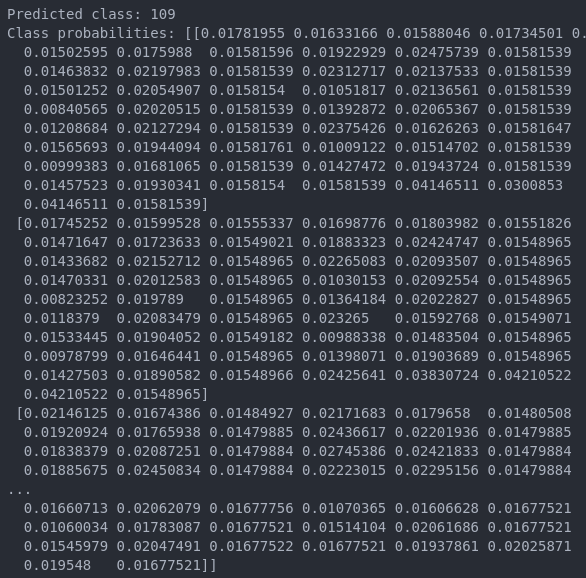

<h1> Pose Estimation - DL Python Project</h1>
 
<h2>Features</h2>
<ul>
    <li>MobileNetV2 image feature extractor with Feature Pyramid Network decoder</li>
    <li>CenterNet prediction heads with custom post-processing logics</li>
    <li>Lightning uses depth multiplier 1.75</li>
</ul>

<h2>Acknowledgments</h2>

<b> Python3: http://bit.ly/python3-certifications </b>
 
<b> Machine Learning: https://bit.ly/machine-learning-certification <b>
 

<h2> Link </h2>
<b> Kaggle: https://www.kaggle.com/models/google/movenet/TensorFlow2/multipose-lightning/1</b>
 

<h2>Photo</h2>

 
<h2>Contact</h2>

<b> Email: mariusc0023@gmail.com </b>
